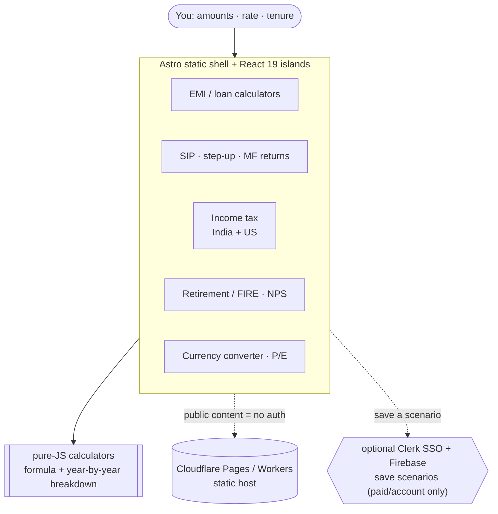

# oriz-finance

> Finance calculators — EMI, SIP, mutual-fund returns, tax (India + US), retirement, mortgage, currency, P/E, NPS. Pure-JS, no server.

[](LICENSE)
[](https://github.com/chirag127/oriz-finance/stargazers)
[](https://github.com/chirag127/oriz-finance/commits)
[](https://astro.build)

**Live app:** https://finance.oriz.in · **About:** https://chirag127.github.io/oriz-finance/ · **Repo:** https://github.com/chirag127/oriz-finance

> **Disclaimer:** General information, not investment advice.

A personal-finance toolkit where the math is the product: EMI, SIP, mutual-fund returns, income tax (India + US), retirement, mortgage, currency conversion, P/E, and NPS. Every calculator shows the formula it used, the assumptions it made, and a year-by-year breakdown — all computed in pure JS in your browser, so inputs never leave your device.

⭐ If this is useful, please [star the repo](https://github.com/chirag127/oriz-finance/stargazers) — it helps others find it.

## How it works



## Features

- **EMI / loans** — home, car, personal, education; amortization schedule.
- **SIP** — regular + step-up, with maturity and invested-vs-returns breakdown.
- **Mutual-fund returns** — lumpsum / CAGR / XIRR style projections.
- **Income tax** — India (old vs new regime) and US.
- **Retirement / FIRE** and **NPS** planning.
- **Mortgage**, **currency converter**, and **P/E** helpers.
- Every calculator shows its **formula, assumptions, and year-by-year table** — all **pure-JS client-side computation**, inputs never leave the device.
- Public content requires **no auth**; Clerk SSO gates only optional account/paid features (e.g. saving a scenario).

## Tech stack

- **Astro 6** static output.
- **React 19** islands.
- **Tailwind CSS v4** with a bespoke per-site theme.
- **Shared oriz packages** — `@chirag127/astro-chrome`, `@chirag127/astro-data`, `@chirag127/astro-shell`, `@chirag127/oriz-ui`, and the atomic `@chirag127/oz-*` set.
- **[@clerk/clerk-react](https://clerk.com/docs)** — optional shared `*.oriz.in` SSO (account features only).
- **[firebase](https://firebase.google.com/)** — Firestore for small per-user saved data (Spark plan).
- **[lucide-react](https://lucide.dev/)** — icons.
- **Vitest** (unit + coverage) + **Playwright** (e2e); **Biome** lint/format.
- **Cloudflare** (Pages / Workers) via **wrangler** — static hosting. Package manager: **pnpm**.

## Repo structure

```
oriz-finance/
├── src/
│   ├── pages/          # Astro routes (one per calculator)
│   ├── components/      # React islands (calculators, charts, tables)
│   ├── lib/            # pure-JS finance math (EMI, SIP, tax, XIRR…)
│   ├── layouts/        # base HTML layout / meta
│   └── styles/         # Tailwind v4 entry + theme tokens
├── tests/             # Vitest specs + Playwright e2e
├── public/            # static assets, icons, manifest
└── astro.config.mjs   # Astro config
```

## Screenshots

See the live app in action at **https://finance.oriz.in**.

## Quick start

```bash
pnpm install
pnpm dev          # local dev server
pnpm test         # vitest (unit)
pnpm build        # static build → dist/
pnpm deploy       # wrangler deploy (Cloudflare)
```

Other scripts: `pnpm typecheck` (astro check), `pnpm lint` / `pnpm format` (Biome), `pnpm test:e2e` (Playwright), `pnpm test:coverage`.

## Configuration

Calculators are **pure-JS client-side** and need no env vars. The following `PUBLIC_*` (client-only, browser-safe) keys enable optional account/data features; a server-side worker holds any secret keys, never the static site.

| Env var | Purpose |
| --- | --- |
| `PUBLIC_CLERK_PUBLISHABLE_KEY` | Clerk publishable key — client-only; gates optional account features via shared `*.oriz.in` SSO. |
| `PUBLIC_FIREBASE_API_KEY` | Firebase client API key (Firestore for saved scenarios). |
| `PUBLIC_FIREBASE_AUTH_DOMAIN` | Firebase auth domain. |
| `PUBLIC_FIREBASE_PROJECT_ID` | Firebase project id. |
| `PUBLIC_FIREBASE_STORAGE_BUCKET` | Firebase storage bucket. |
| `PUBLIC_FIREBASE_MESSAGING_SENDER_ID` | Firebase messaging sender id. |
| `PUBLIC_FIREBASE_APP_ID` | Firebase app id. |
| `PUBLIC_ALPHA_VANTAGE_PROXY` | Public Worker URL the markets features fetch from (the Alpha Vantage key itself lives only on the Worker). |

Names only — never commit values. Secrets (e.g. `ALPHA_VANTAGE_API_KEY`, Clerk secret key) live on the Worker / vault, never on the static site.

## Part of the oriz family

One of ~80 sites in the [oriz](https://blog.oriz.in) family — a fleet of small, fast, client-side tools that run **$0 on the Cloudflare free tier**.

> **Hosting:** the canonical live app is served from **Cloudflare** at [finance.oriz.in](https://finance.oriz.in). GitHub Pages serves a separate info/landing page at [chirag127.github.io/oriz-finance](https://chirag127.github.io/oriz-finance/).

## Related projects

- [oriz-invoice](https://github.com/chirag127/oriz-invoice) — GST-aware invoice generator.
- [oriz-auth-app](https://github.com/chirag127/oriz-auth-app) — the shared SSO hub this app uses.
- [oriz-chat](https://github.com/chirag127/oriz-chat) — free client-side AI chat.
- [oriz-text](https://github.com/chirag127/oriz-text) — writing-desk text toolkit.

## Contributing

Issues and PRs welcome. Conventional commits are the changelog.

## Status

Stable (core calculators live; more calculators in progress).

## Security

No plaintext secrets in the repo; sops + age vault. `PUBLIC_*` keys are client-only; secret keys stay on the Worker / server runtime.

## License

MIT © 2026 Chirag Singhal · chirag@oriz.in
